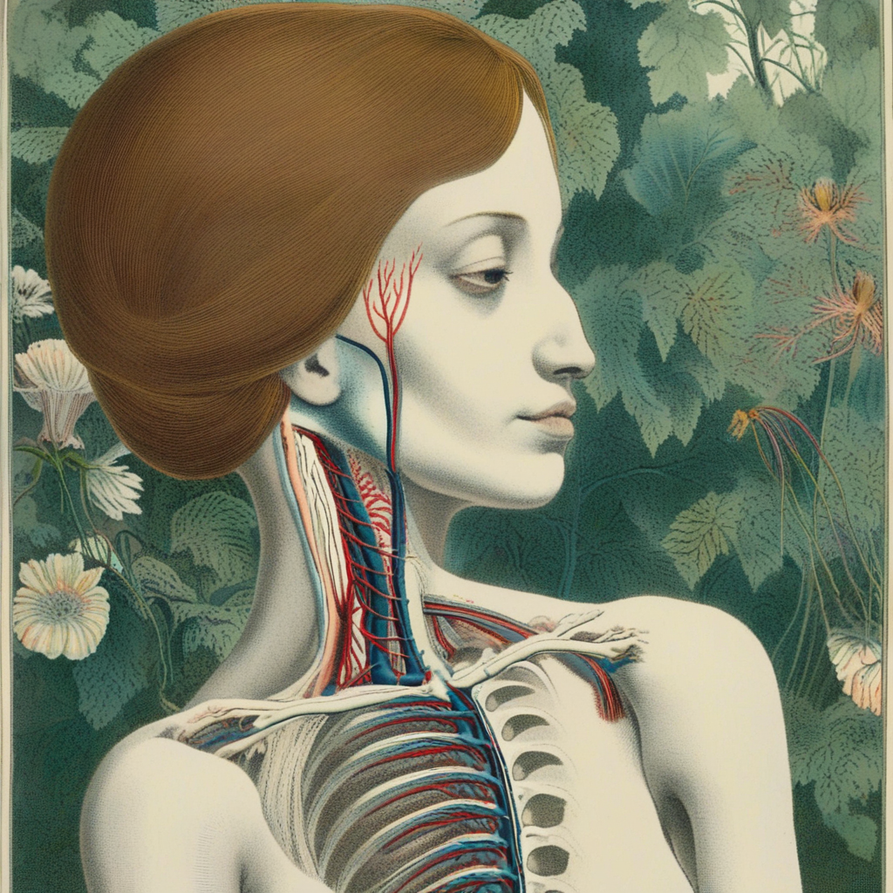
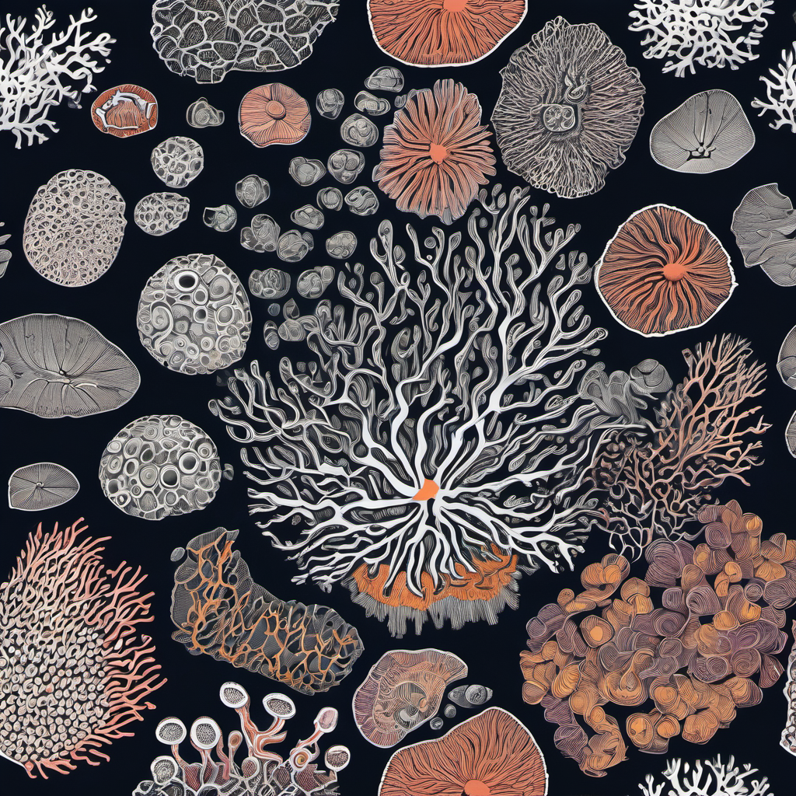
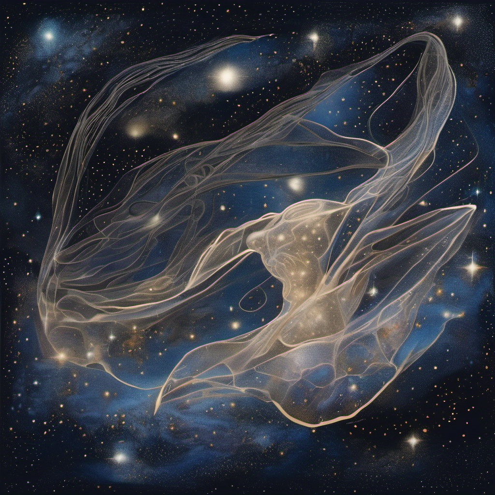

# Anatomica Scientifica 

An SDXL LoRA trained on 150 historic medical and scientific illustrations of anatomy and human biology.  

Two safetensor files are available. This was my first time training a model so they both have their differences. I thought my first two training attempts failed, but it turned out to just be a formatting issue. Because of this misunderstanding I changed a bunch of stuff on the third run, including the trigger word. 

anatomica-scientifica-2nd-training-attempt - trigger word is anatomica-scientifica

anatomica-scientifica-3rd-training-attempt - trigger word is AS101 

## other terms that were used a lot and will yield intersting results:
microscopic detail, human brain, dissection, male figure, female figure, arteries and veins, organic form, organs, tissue, bone, ancient art, scientific illustration, hand drawn
 

test this LoRA live on Civitai 
https://civitai.com/models/1924370

## Example image results:

