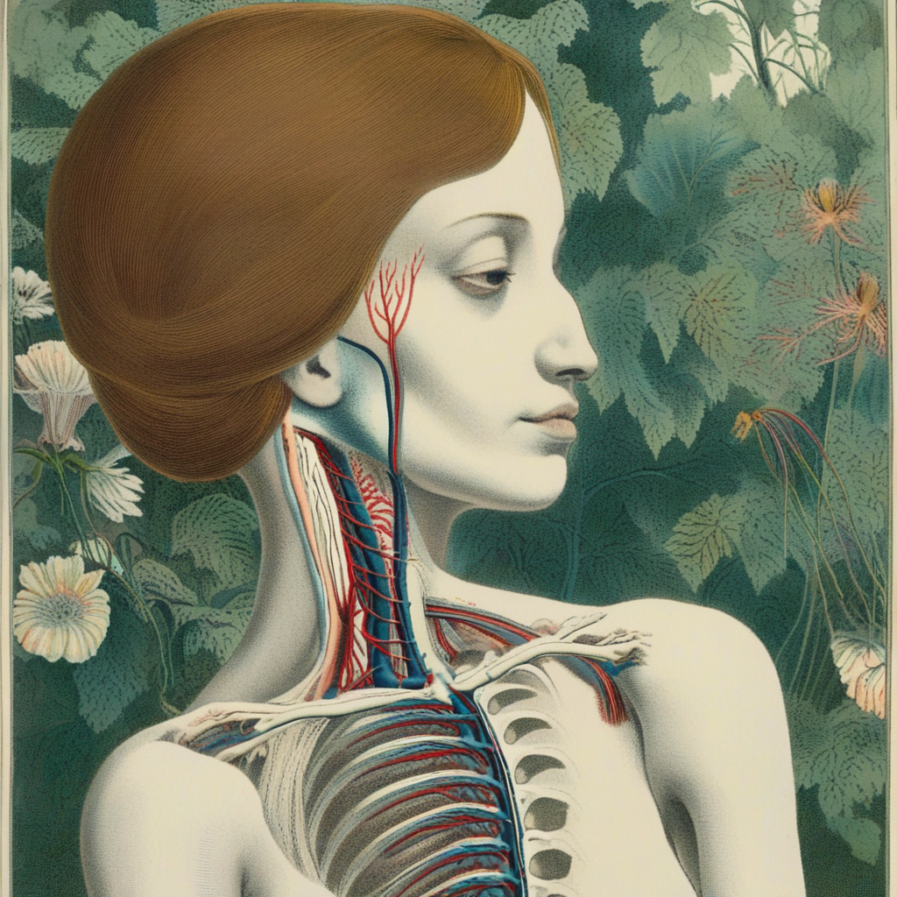

# Anatomica Scientifica 

An SDXL LoRA trained on 150 historic medical and scientific illustrations of anatomy and human biology.  

Two safetensor files are available. This was my first time training a model so they both have their differences. I wrote a post on medium about it if you want more of an explanation. (link to medium article)

anatomica-scientifica-2nd-training-attempt - trigger word is scientifica-anatomica

anatomica-scientifica-3rd-training-attempt - trigger word is AS101 

## other terms that were used a lot and will yield intersting results:
microscopic detail, human brain, dissection, male figure, female figure, arteries and veins, organic form, organs, tissue, bone
 
I used different trigger words because I originally thought I trained it wrong the first two times, so changed the whole dataset. It is all explained in the blog post. link to blog post. 

## Example image results:

